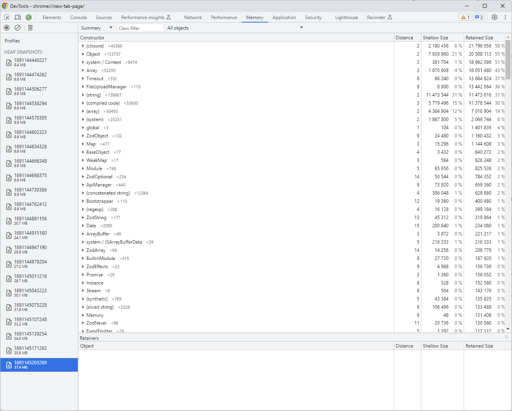

# crystallize-import-utilities-example

Simple Node.js project for testing [Crystallize](https://crystallize.com/) [import-utilities](https://github.com/CrystallizeAPI/import-utilities).

## How to run it

1. Prepare `.env` file based on `.env.sample`.
2. Run `npm install`.
3. Update product information in `index.ts`.
4. Run the following command `npm run dev`.

## How to test it

1. Run `npm run dev`.
2. Open new terminal and run `node ./requests/test.js`.

### How testing works

1. Run a request responsible for creating an initial memory dump.
2. Wait 2 seconds.
3. Run the iteration of tests 10 times. Each iteration contains:
    1. Send 10 requests to an endpoint responsible for updating a product in Crystallize by import-utilities library.
    2. Wait 30 seconds.
    3. Send a request responsible for running garbage collection.
    4. Wait 2 seconds.
    5. Send a request responsible for create a memory dump.
4. In the end there should be 11 memory dumps in `memory-dump` directory in the main directory of this project.
5. You can analyze and compare individual memory dumps in Chrome developer tools:

